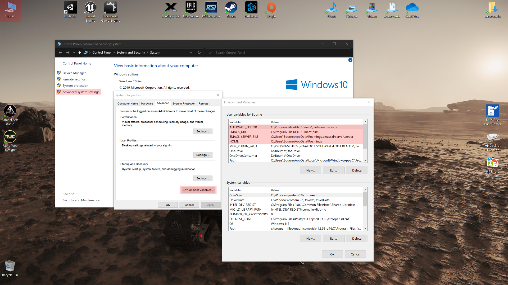

<div align="center">
  
  <h1>GNU Emacs configuration</h1>
  <p>This is my simply Emacs configuration files for work on GNU Linux and MS Windows.</p>
  <br>
  <br>
  <h6>Kaolin-dark theme for GUI</h6>
  
  <br>
  <br>
  <h6>Kaolin-dark theme for TTY</h6>
  
  <br>
  <br>
 </div>

## Edit configuration

Edit the configuration files as you like. First of all, pay attention to the settings of the UI.

###### Configuration files:


```yaml

.emacs.d/:
    - init.el                         # Main initialization file
    
    config/:
        - packages.org                # Set packages for autoinstall on startup
        - utils.org                   # Common library
        - common.org                  # Common settings
        - keybindings.org             # Keybinding maps
        
        - theme-gui.org               # GUI theme settings
        - theme-tty.org               # TTY theme settings
        
        - common-lisp-language.org    # Settings for lisp-mode [ .lisp ]
        - python-language.org         # Settings for elpy-mode [ .py ]
        - rust-language.org           # Settings for rustic-mode [ .rs ]

```


<br>

## Quick start for GNU Linux

<br>

### Install the `Git` and `Emacs` packages if not already installed

###### Gentoo-based:
```
sudo emerge -av dev-vcs/git

sudo touch /etc/portage/package.use/app-editors
sudo echo "app-editors/emacs gpm ssl threads xpm zlib X gtk2 imagemagick jpeg png svg" \
> /etc/portage/package.use/app-editors

sudo emerge -av app-editors/emacs
````

###### Debian-based:
```
sudo apt install git
sudo apt install emacs
```

###### RPM-based:
```
sudo yum install git

sudo yum install epel-release
sudo yum install emacs
```

<br>

### Clone this repository to your home directory

```
cd ~/
git clone https://github.com/SciBourne/.emacs.d.git
```

<br>

### Running Emacs as a server

I give an example for **Gentoo Linux** with **OpenRC** init system. For other distribution see [EmacsWiki](https://www.emacswiki.org/emacs/EmacsAsDaemon#toc6).

###### Configure:
```
sudo emerge -av app-emacs/emacs-daemon

sudo ln -s /etc/init.d/emacs /etc/init.d/emacs.<user-name>
sudo rc-update add emacs.<user-name> default
sudo rc-service emacs.<user-name> start
```
###### Usage:
```
emacs --daemon=<server-name>        # usage UNIX socket for comminication
emacsclient -t -s <server-name>     # for TTY
emacsclient -c -s <server-name>     # for GUI
```

<br>

## Quick start for MS Windows

<br>

### Installation `Emacs` binary package with `ImageMagic` support

* Download [emax64-bin-26.3.7z](https://github.com/m-parashar/emax64/releases/download/20191225/emax64-bin-26.3.7z)
* Create a folder `C:\Program Files\GNU Emacs` and unpack this archive into it
* Run file `C:\Program Files\GNU Emacs\bin\addpm.exe` as administrator for add Emacs shortcuts to the Start menu

<br>

### `Git` installation

You can use any of these app:
* [Github Desktop](https://desktop.github.com)
* [Git for Windows](https://github.com/git-for-windows/git/releases/download/v2.27.0.windows.1/Git-2.27.0-32-bit.exe)

<br>

### Clone this repository to your machine

Run **CMD**, **Power Shell** or **Windows Terminal** as your user and run this commands:
```
cd "C:\User\<user-name>\AppData\Roaming"
git clone https://github.com/SciBourne/.emacs.d.git
```

<br>

### Create environment variables

Create the following variables:
```
HOME="C:\User\<user-name>\AppData\Roaming"
EMACS_DIR="C:\Program Files\GNU Emacs\bin"
ALTERNATE_EDITOR="C:\Program Files\GNU Emacs\bin\runemacs.exe"
EMACS_SERVER_FILE="C:\Users\<user-name>\AppData\Roaming\.emacs.d\server\server"
```


<br>

### Startup Emacs as a server

<br>

Create Emacs shortcuts:
* **GNU Emacs Daemon**

    with `--daemon` argument in Startup folder `(shell:startup in explorer)`
* **GNU Emacs Client**

    with `-c -n -a runemacs.exe` arguments in Programs folder `(shell:programs in explorer)`
* **GNU Emacs IDE**

    without arguments in Programs folder `(shell:programs in explorer)`

<br>
<br>

Run PowerShell as your user and input this following code:

<br>

###### Emacs daemon:
<sub><i>(to start the daemon after system boot)</i></sub>
```
$Startup = "$Home\AppData\Roaming\Microsoft\Windows\Start Menu\Programs\Startup"
$WshShell = New-Object -comObject WScript.Shell
$Shortcut = $WshShell.CreateShortcut("$Startup\GNU Emacs Daemon.lnk")
$Shortcut.TargetPath = "C:\Program Files\GNU Emacs\bin\runemacs.exe"
$Shortcut.Arguments = "--daemon"
$Shortcut.Save()
```

<br>

###### Emacs client:
<sub><i>(for use as default text editor)</i></sub>
```
$Startup = "$Home\AppData\Roaming\Microsoft\Windows\Start Menu\Programs"
$WshShell = New-Object -comObject WScript.Shell
$Shortcut = $WshShell.CreateShortcut("$Startup\GNU Emacs Client.lnk")
$Shortcut.TargetPath = "C:\Program Files\GNU Emacs\bin\runemacs.exe"
$Shortcut.Arguments = "-c -n -a runemacs.exe"
$Shortcut.Save()
```

<br>

###### Emacs IDE:
<sub><i>(full config support, usage GUI with treemacs and other packages for programming)</i></sub>
```
$Startup = "$Home\AppData\Roaming\Microsoft\Windows\Start Menu\Programs"
$WshShell = New-Object -comObject WScript.Shell
$Shortcut = $WshShell.CreateShortcut("$Startup\GNU Emacs IDE.lnk")
$Shortcut.TargetPath = "C:\Program Files\GNU Emacs\bin\runemacs.exe"
$Shortcut.Save()
```

<br>

### Add Emacs to context menu

Run **windows-registry** file as administrator:
```
C:\Users\<user-name>\AppData\Roaming\.emacs.d\emacs_explorer.reg
```

<br>
<br>

<h6>Shut up and hack, man ;)</h6>


